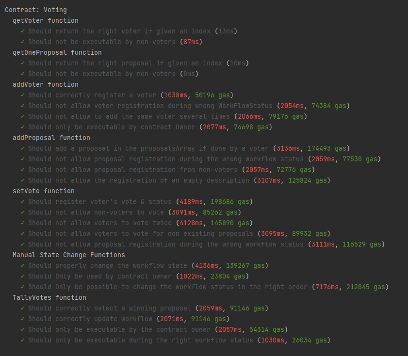

#Smart contract Solidity & bonnes pratiques de sécurité

#Hypothèses

J'ai choisi de tester chaque fonction du contract indépendemment et les ai organisé de cette manière:
- Un test regroupant toutes les assertions pour un cas nominal (bon fonctionnement)
- Un test indépendant pour chaque cas déclenchant un "revert"

Pour les cas nominaux, j'ai fait plusieurs "expect" dans chaque test, je n'ai pas fait un test par porpriété par soucis de concision.

Ayant couvert 100% du Contract en test, j'ai uniquement fait une description de 3 des fonctions du test

---

##Fonction getVoters()

Avant d'effectuer chaque test, j'ai ajouté 3 voters au mapping "Voters"

###1 - Premier test 

Il vérifie que la fonction renvoie le "voter" correspondant à l'index passé en paramètre.

####Assertions:
- La propriété "isRegistered" du voter doit être égale à "true"
- La propriété "hasVoted" du voter doit être égale à "false"
- La propriété "votedProposalId" du voter doit être égale à "0"

###2 - Deuxième test 

Il vérifie que la fonction n'est exécutable que par un voter inscrit.

####Assertions:
- La fonction doit revert si l'address exécutant la fonction n'est pas enregistrée comme voter

---

##Fonction getOneProposal()

Avant d'effectuer chaque test, j'ai ajouté 1 voter au mapping "Voters",
démarré le workflow de registration de proposal,
ajouté deux proposals différentes.

###1 - Premier test

Il vérifie que la fonction renvoie la "Proposal" correspondant à l'index passé en paramètre.

####Assertions:
- La propriété "description" de la proposal retournée doit être égale à celle enregistrée par le Voter dans le "beforeEach()".
- La propriété "voteCount" de chaque Proposal doit être égale à 0

###2 - Deuxième test

Il vérifie que la fonction n'est exécutable que par un voter inscrit.

####Assertions:
- La fonction doit revert si l'address exécutant la fonction n'est pas enregistrée comme voter
    
---

##Fonction addVoter()

Avant d'effectuer chaque test, j'ai ajouté 1 voter au mapping "Voters",
démarré le workflow de registration de proposal,
ajouté deux proposals différentes.

###1 - Premier test

Il vérifie que la fonction enregistre correctement un Voter quand on lui passe une address en paramètre.

####Assertions:
- La propriété "isRegistered" du voter enregistré doit être égale à "true".
- La propriété "hasVoted" du voter enregistré doit être égale à "false".
- L'event "VoterRegistered" doit être émis avec en paramètre l'address du Voter ajouté.

###2 - Deuxième test 

Il vérifie que l'exécution de la fonction n'est pas possible si la vraiable d'état "workflowStatus" n'est pas égale à "RegisteringVoters".

####Assertions:
- La fonction doit revert si la variable workFlowStatus a un statut autre que "RegisteringVoters.

###3 - Troisième test

Il vérifie que la fonction ne permet pas d'ajouter plusieurs fois le même Voter.

####Assertions:
- La fonction doit revert si l'address passée en paramètre est déja présente dans le mapping "Voters".

###4 - Quatrième test

Il vérifie que la fonction n'est exécutable que par l'address ayant déployé le contrat.

####Assertions:
- La fonction doit revert si l'address exécutant le contrat n'est pas celle enregistrée dans la variable "Owner".

#Temps d'exécution & Coût en gas

